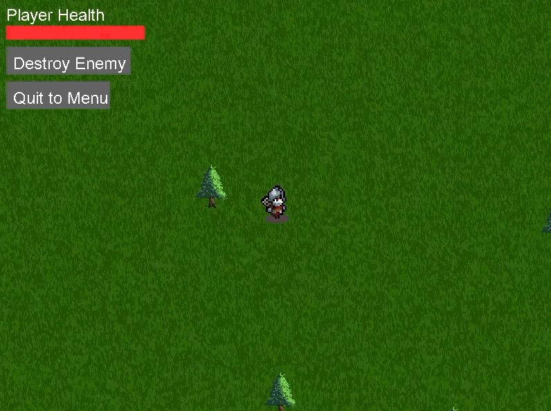

# SpriteForge

SpriteForge is a custom 2D Game Engine written in C, using SDL2 and CMake!



## Engine Features

Currently, the engine features:

- A robust Input system
- High-quality, yet efficient 2D graphics rendering
- Asset management via user projects
- Advanced entity and object system
- Real-time physics and collisions
- Music & Audio system
- UI management
- Events and Messaging

## Installation & Setup

To run SpriteForge on your machine (specifically targeting Windows), you will need to install a few development tools. Follow these step-by-step instructions to get up and running:

### 1. Prerequisites
Before you start, you must install the following software if you do not have them already:
- **Visual Studio**: Download and install [Visual Studio Community](https://visualstudio.microsoft.com/vs/community/). During installation, make sure to select the **"Desktop development with C++"** workload.
- **Git**: Download and install [Git for Windows](https://git-scm.com/download/win).
- **CMake**: Download and install [CMake](https://cmake.org/download/). Make sure to check the option to "Add CMake to the system PATH" during installation.

### 2. Clone the Repository
Open a terminal (such as PowerShell or Command Prompt) and clone the engine to your computer:
```bash
git clone https://github.com/your-username/spriteforge.git
cd spriteforge
```

### 3. Setup VCPKG & Install Dependencies
This project uses **vcpkg** as its package manager to handle SDL2 and Lua. 
If the `vcpkg` folder in this repository is empty, initialize it by running:
```bash
git clone https://github.com/microsoft/vcpkg.git
.\vcpkg\bootstrap-vcpkg.bat
```
*(If vcpkg is already fully present in the folder, just run the bootstrap script above).*

Now, use vcpkg to install the engine's required libraries (SDL2, SDL_image, SDL_ttf, and Lua) for 64-bit Windows:
```bash
.\vcpkg\vcpkg install sdl2 sdl2-image sdl2-ttf sdl2-mixer lua --triplet=x64-windows
```

### 4. Build the Engine
With the dependencies installed, you can now use CMake to generate the build files and compile the engine. Run the following commands from the root `spriteforge` directory:

```bash
# Generate the build files inside a "build" folder, pointing CMake to vcpkg
cmake -B build -S . -DCMAKE_TOOLCHAIN_FILE="vcpkg/scripts/buildsystems/vcpkg.cmake"

# Compile the engine!
cmake --build build
```

### 5. Run SpriteForge!
Once compilation is complete, your executable will be located in the `build/Debug` (or `build/Release`) directory. Because we set up a CMake post-build step, your game project folders (`example_projects` and `user_projects`) are automatically copied to the build folder!

To launch the engine, simply run:
```bash
.\build\Debug\spriteforge.exe
```

## Future plans

- [ ] **World generation**
  - For a minecraft style game maybe?
  - Horror coop style game (preset maps but randomly generated each level to make each level different/harder) (factory/forest, randomly generated each time)

- [ ] **NPC Pathfinding**
  - Entities following a predefined route?
  - Entities tracking player (enemies?)
